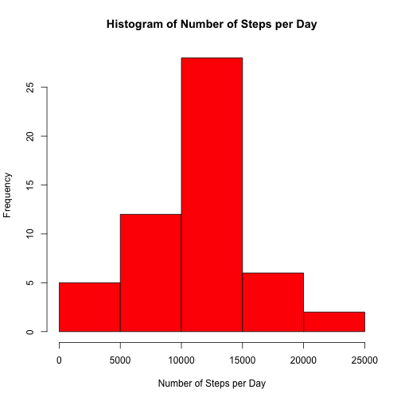
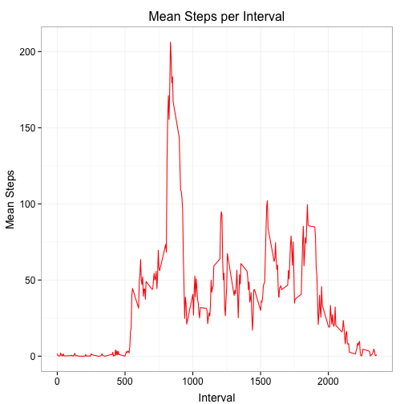
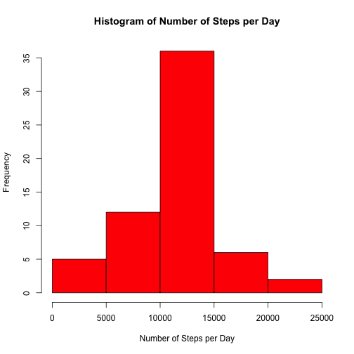
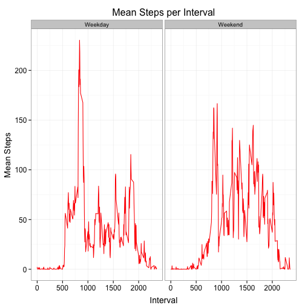

Reproducible Research - Assignment 1
=======================================================================

### Introduction

It is now possible to collect a large amount of data about personal movement using activity monitoring devices such as a Fitbit, Nike Fuelband, or Jawbone Up. These type of devices are part of the “quantified self” movement – a group of enthusiasts who take measurements about themselves regularly to improve their health, to find patterns in their behavior, or because they are tech geeks. But these data remain under-utilized both because the raw data are hard to obtain and there is a lack of statistical methods and software for processing and interpreting the data.

This assignment makes use of data from a personal activity monitoring device. This device collects data at 5 minute intervals through out the day. The data consists of two months of data from an anonymous individual collected during the months of October and November, 2012 and include the number of steps taken in 5 minute intervals each day.

### Step 1:  Loading and preprocessing the data

The code below reads in the data and converts the date field to the appropriate date class.  This is required for later sections of the assignment.  Libraries used throughout the code are also declared here.


```r
# set the working directory
setwd("/users/Richard/Documents/Coursera Data Science Track/Reproducable Research/RepData_PeerAssessment1")
getwd()
```

```
## [1] "/Users/Richard/Documents/Coursera Data Science Track/Reproducable Research/RepData_PeerAssessment1"
```

```r
library(dplyr)
library(ggplot2)

activity_ds_main <- read.csv(file = "activity.csv",
                              header = T,
                              sep = ",")

# convert the date variable to date class
activity_ds_main$date <- as.Date(activity_ds_main$date,"%Y-%m-%d")
class(activity_ds_main$date)
```

```
## [1] "Date"
```

```r
# remove the missing
complete <- complete.cases(activity_ds_main)
activity_ds_no_miss <- activity_ds_main[complete,]

head(activity_ds_no_miss)
```

```
##     steps       date interval
## 289     0 2012-10-02        0
## 290     0 2012-10-02        5
## 291     0 2012-10-02       10
## 292     0 2012-10-02       15
## 293     0 2012-10-02       20
## 294     0 2012-10-02       25
```

```r
summary(activity_ds_no_miss)
```

```
##      steps            date               interval   
##  Min.   :  0.0   Min.   :2012-10-02   Min.   :   0  
##  1st Qu.:  0.0   1st Qu.:2012-10-16   1st Qu.: 589  
##  Median :  0.0   Median :2012-10-29   Median :1178  
##  Mean   : 37.4   Mean   :2012-10-30   Mean   :1178  
##  3rd Qu.: 12.0   3rd Qu.:2012-11-16   3rd Qu.:1766  
##  Max.   :806.0   Max.   :2012-11-29   Max.   :2355
```

### What is mean total number of steps taken per day?

This section of the assignment will:

* Calculate the total number of steps taken per day
* Make a histogram of the total number of steps taken each day
* Calculate and report the mean and median of the total number of steps taken per day


```r
# calculate the total number of steps taken per day
tot_steps_per_day <- activity_ds_no_miss %>%
                     group_by(date) %>%
                     summarize(total_steps = sum(steps)) %>%
                     arrange(date)

# make a histogram of the total number of steps taken per day
hist(tot_steps_per_day$total_steps,
     col = "red",
     xlab = "Number of Steps per Day",
     main = "Histogram of Number of Steps per Day")
```

 

```r
# Calculate and report the mean and median of the total number of steps taken per day
mean(tot_steps_per_day$total_steps)
```

```
## [1] 10766
```

```r
median(tot_steps_per_day$total_steps)
```

```
## [1] 10765
```

### What is the average daily activity pattern?

This section of the assignment will:

*  Make a time series plot of the 5-minute interval (x-axis) and the average number of steps taken, averaged across all days (y-axis)
*  Identify Which 5-minute interval, on average across all the days in the dataset, contains the maximum number of steps

The following code chunk calculates the mean steps per interval across all days and then generates a line chart of the data using ggplot2.


```r
# Calculate the mean steps across all days for each time interval
mean_steps_per_interval <- activity_ds_no_miss %>%
                           group_by(interval) %>%
                           summarize(mean_steps = mean(steps)) %>%
                           arrange(interval)

# Create a line chart of this data
g <- ggplot(mean_steps_per_interval,aes(interval,mean_steps)) +
     geom_line(color = "red") +
     theme_bw() + 
     ggtitle("Mean Steps per Interval") +
     xlab("Interval") + 
     ylab("Mean Steps") +
     theme(axis.title.y=element_text(vjust=1,size=14),
           axis.title.x=element_text(vjust=-0.5,size=14),
           plot.title=element_text(vjust=1,size=16),
           axis.text.x = element_text(size = 12),
           axis.text.y = element_text(size = 12))
g
```

 

This code chunk identifies the time interval with (on average) the maxinum number of steps.


```r
# Which 5-minute interval, on average across all the days in the dataset, contains the maximum number of steps?
max_steps <- which.max(mean_steps_per_interval$mean_steps)
max_steps2 <- mean_steps_per_interval[max_steps,1]
```

The time interval with the maximum steps was 835

### Imputing missing values

This section of the assignment will:

*  Calculate and report the total number of missing values in the dataset (i.e. the total number of rows with NAs)
*  Devise a strategy for filling in all of the missing values in the dataset
*  Create a new dataset that is equal to the original dataset but with the missing data filled in
*  Make a histogram of the total number of steps taken each day and Calculate and report the mean and median total number of steps taken per day

The following code chunk calculates the number of rows with a missing value in the data frame.


```r
# Calculate and report the total number of missing values in the dataset (i.e. the total number of rows with NAs)
num_miss <- nrow(activity_ds_main) - sum(complete.cases(activity_ds_main))
```

The total number of rows with missing data is 2304

The code chunk below removes all missing rows from the data frame, replaces the steps with mean per interval (as calculated above) and then merges the data frames together to create a new data frame with the imputed missing values


```r
# create a data frame of only the rows with a missing value
all_missing <- activity_ds_main[!complete,]

# remove the steps column (currently all missing)
all_missing <- all_missing[,-1]

# merge the average steps by interval and rename the column
all_missing <- merge(all_missing,mean_steps_per_interval,by = "interval",all.x = T)
colnames(all_missing)[3] <- "steps"

# Create a new dataset that has the same number of rows as the original dataset but with the missing data filled in
activity_ds_miss_replace <- rbind(activity_ds_no_miss,all_missing)
activity_ds_miss_replace <- arrange(activity_ds_miss_replace,date,interval)
```

The code below calculates the total number of steps taken per day with the imputed missing values and plots a histogram of the data.


```r
# calculate the total number of steps taken per day for the dataset with the imputed missings
tot_steps_per_day_miss_replace <- activity_ds_miss_replace %>%
                                  group_by(date) %>%
                                  summarize(total_steps = sum(steps)) %>%
                                  arrange(date)

# make a histogram of the total number of steps taken per day for the datsaet with the imputed missing values
hist(tot_steps_per_day_miss_replace$total_steps,
     col = "red",
     xlab = "Number of Steps per Day",
     main = "Histogram of Number of Steps per Day")
```

 

The final code chunk in this section compares the mean and median of the total steps taken per day for the imputed and original data.


```r
# mean for original data
mean(tot_steps_per_day$total_steps)
```

```
## [1] 10766
```

```r
# mean for imputed data
mean(tot_steps_per_day_miss_replace$total_steps)
```

```
## [1] 10766
```

```r
# median for original data
median(tot_steps_per_day$total_steps)
```

```
## [1] 10765
```

```r
# median for imputed data
median(tot_steps_per_day_miss_replace$total_steps)
```

```
## [1] 10766
```

The means and medians are very similar for the imputed data

### Are there differences in activity patterns between weekdays and weekends?

This section of the assignment will:

*  Create a new factor variable in the dataset with two levels – “weekday” and “weekend” indicating whether a given date is a weekday or weekend day
*  Make a panel plot containing a time series plot of the 5-minute interval (x-axis) and the average number of steps taken, averaged across all weekday days or weekend days (y-axis)

The code chunk below creates the "weekday" and "weekend" factor variable.


```r
activity_ds_miss_replace$weekday <- ifelse(weekdays(activity_ds_miss_replace$date) %in% c("Saturday","Sunday"),
                                           "Weekend",
                                           "Weekday")
table(activity_ds_miss_replace$weekday)
```

```
## 
## Weekday Weekend 
##   12960    4608
```

Finally the code below creates the panel plot.


```r
# calculate the mean steps by interval across weekday and weekends
weekday_weekend_summ <- activity_ds_miss_replace %>%
                        group_by(weekday,interval) %>%
                        summarize(mean_steps = mean(steps)) %>%
                        arrange(weekday,interval)

# plot the data in a panel plot
g <- ggplot(weekday_weekend_summ,aes(interval,mean_steps)) +
            facet_wrap(~ weekday) +
            geom_line(color = "red") +
            theme_bw() + 
            ggtitle("Mean Steps per Interval") +
            xlab("Interval") + 
            ylab("Mean Steps") +
            theme(axis.title.y=element_text(vjust=1,size=14),
                  axis.title.x=element_text(vjust=-0.5,size=14),
                  plot.title=element_text(vjust=1,size=16),
                  axis.text.x = element_text(size = 12),
                  axis.text.y = element_text(size = 12))
g
```

 


